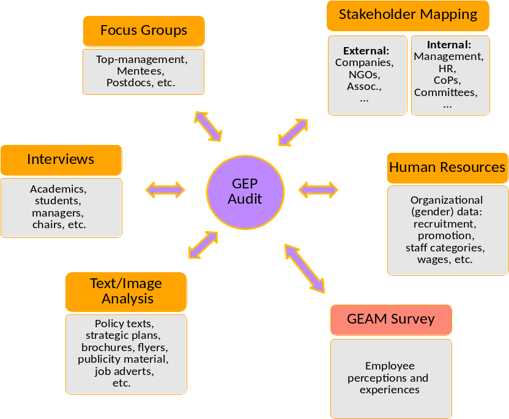
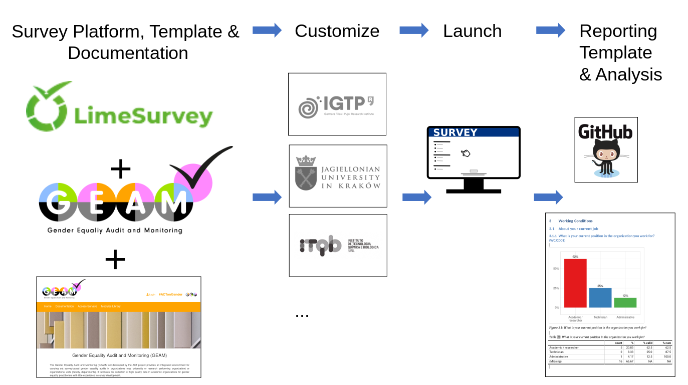

Understanding the GEAM
======================

The ACT Gender Equality Audit and Monitoring (GEAM) survey is a modular questionnaire framework which captures the perceptions of employees regarding key dimensions of gender equality within an organizational unit. Ideally it is launched during the initial stages of a Gender Equality Plan to understand better the specific challenges faced by each institution from the perspective of its employees. As such it complements other types of data collected for example from Human Resource departments on the representation of women and men across different staff categories and salary brackets. 

The GEAM questionnaire offers a second layer of insights abouts people's experiences and perceptions within an organization. Perceptions are important for example to understand the working climate, experiences of bullying or harrassment, burnout or job satisfaction. Overall, it provides a holistic picture regarding the experience of gender equality that goes beyond the basic, numerical representation and participation of women and men within an organization. It offers a unique tool to capture the perceptions and experiences of **working conditions from a gender perspective**.

GEAM as *one* element of GEP Audit
----------------------------------

The GEAM survey is a starting off point that provides organisations with a consistent and validated means of collecting gender equality data. As such it forms part of the usual GEP design, implementation and monitoring processes. As such it should be used in conjunction with other means of data collection, such sa focus groups, semi-structured interviews, document analysis as illustrated below:



In addition, the GEAM should not be seen as something that can be setup and run by a single person. Rather, it requires a combination of key individuals from the organisation to setup and above all **interpret the results** of the survey in context, to determine what these results mean in terms of the organisation's next steps for their gender equality plans, and to implement these action plans effectively.

In the UK, for example, the Athena SWAN charter programme describes the collection of gender equality data as only part of the process. Institutions and departments applying to this gender equality award scheme, as a very first step, need to create a self-assessment team that includes:

-   staff who can collect and analyse the appropriate data (e.g. researchers and social scientists from within the organization and representatives from Human Resources with access to staff data);
-   decision-makers who can ensure that gender equality work in the organization receives the resources required to deliver it, and integrate the findings into organizational strategy and decision-making.

An effective self-assessment team must have authority within the organization, and include a **variety of staff members** so that those involved in the interpretation and application of the research results are representative of the overarching staff population of the organization. For example, the team should include staff on different types of contracts (i.e. full- versus part-time; researchers, academics and administrative staff) and from different parts of the organization (i.e. one person from each faculty or department).

Having an effective team and undertaking a thorough self-assessment is key to an organization's gender equality research and planning. A thorough self-assessment includes, but is not limited to the following activities:

-   Reflecting on a range of quantitative and qualitative data to identify both challenges and opportunities with regards to gender equality, collected through the GEAM as well as through other methods such as focus groups and interviews with key members of staff.
-   Evaluating relevant policies, practices and activities.
-   Responding to the findings of the above and establishing gender equality-based priority areas and appropriate aspirations and targets.
-   Developing an evidence-based, comprehensive action plan to underpin advancement against the agreed priorities.
-   Evaluating the effectiveness of actions undertaken on an ongoing basis, to ensure actions are delivering impact against objectives, and evolving the action plan in response to evaluation.

The GEAM should be seen as an available instrument that a self-assessment team can use to gather high quality data within their organization.


Thematic coverage and modules
-----------------------------

The GEAM tool includes several thematic question modules that cover different aspects related to gender equality in the work place:

-   **Socio-demographics/ academic position** questions collect information on the following: date of birth, citizenship status(es), religious belief, gender, sexual orientation, trans history, disability, highest qualification, parents' highest qualifications and net salary.

-   **Working conditions** questions collect information on the following: position in organization, academic field, bonus, faculty/ department, contract type, career access, progression, barriers and development training, caring responsibilities, work role responsibilities, job satisfaction, work-family balance, leave support and workload.

-   **Organizational culture and climate** questions collect information on representation of men and women, gender equality, differences in allocation of roles, promotions, treatment, perceptions of work environment and climate, recruitment factors, promotion factors, masculinity perceptions.

-   **Interpersonal behaviors and experiences** questions collect information on microaggressions, harassment, bullying and stalking, organizational workplace culture on bullying and harassment.

Adaptability and comparability
------------------------------

The GEAM builds on the ASSET 2016 Survey developed by Advance HE and offers a standardized monitoring tool to be utilized by higher education institutions across the EU and beyond.

Additional questions and response options, where possible, use proven measurement scales that show reliable results for internal consistency such as a high Cronbach alpha mean. An overview of the scientific background literature for the chosen scales is available in [@AldercotteACTGenderEquality2019].

In order to maintain the quality of the collected data, we recommend to **not modify individual answer options**. The GEAM survey consists of the GEAM Core questionnaire, which is a set of standardized questions that have been tested across the EU and beyond. The phrasing and response options of the GEAM Core should not be modified, as they have been designed with comparability across individual organizations in mind. However, the GEAM needs to be flexible and adaptable to the specific context of the target organization or organizational unit. As such we have included a repository of additional questions (in the Extended GEAM) that can be added, modified and personalized to individual contexts. The balance between comparability of data, data quality and the relevance of the questionnaire for a given organizational context is not always easy to achieve.

In section [Adapting questionnaire content](#adapting-content) we provide an overview which questions **need to be adapted**. If you need to make changes to other questions, we recommend to delete/add entire questions but **not to modify the wording of question texts or answer options**.

Overview of the GEAM workflow
-----------------------------

The GEAM tool includes several components that faciliate the steps involved in designing, launching, and reporting of an online questionnaire. A standard workflow for carrying out a GEAM suirvey and reporting is shown in the following illustration (from left to right):



1.  The GEAM questionnaire provides the initial building block. It is already implemented in 8 languages using the ACT LimeSurvey installation.
2.  After gaining access to a new copy, survey administrators can concentrate on customizing questionnaire content to their specific organizational needs. Extensive documentation is available (in this document) to help users to manage LimeSurvey, adapt questions and safely manage their data.
3.  The survey is then ready to launch. Survey administrators can monitor response rates and manage reminders for as long as needed.
4.  After the completion of the survey, a reporting template is available to generate the descriptive statistics report. A further analysis handbook guides readers to carry out a more in-depth statistical analysis and interpretation of their results.

The GEAM framework substantially reduces the time needed to setup and launch an online survey. Together with the reporting templates, it furthermore saves valuable time on the reporting task - time that can be reinvested in the interpretation of results and the design of gender equality measures.

Visual quickstart
-----------------

For an overview of the GEAM tool see [GEAM Introduction](https://vimeo.com/438557308)

```{block}
<iframe title="vimeo-player" src="https://player.vimeo.com/video/438557308" width="640" height="360" frameborder="1" allowfullscreen></iframe>
```

For basic notions of how to edit and adapt the GEAM questionnaire see [GEAM First Steps](https://vimeo.com/422763740)

```{block}
<iframe title="vimeo-player" src="https://player.vimeo.com/video/422763740" width="640" height="360" frameborder="1" allowfullscreen></iframe>
```
