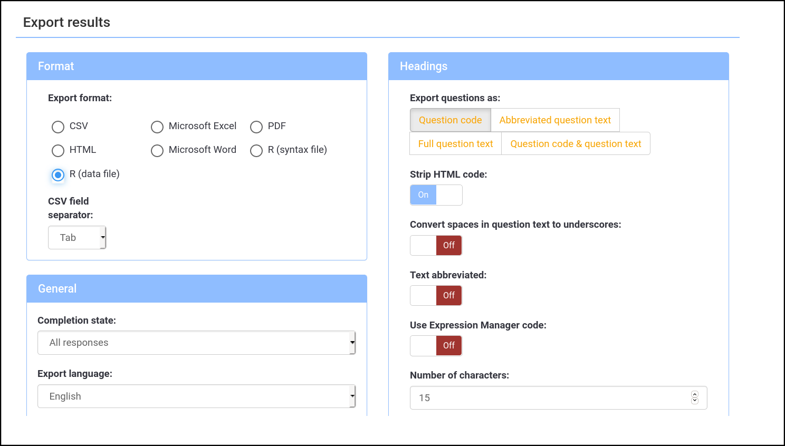

Accessing results
=================

Monitoring progress
-------------------

Several options are available to track responses while your survey is active. A first overview regarding the "Partial", "Full", "Total" responses is available from the survey listing after logging onto the system.

A more detailed view is available from the "Responses & Statistics" section.

```{block, type="noteManual"}
Corresponding online manual section: 
https://manual.limesurvey.org/Responses 
```

An overview of all variables (columns) is displayed (see next Illustration) with their corresponding data entries. Each row represents one respondent. The column "Lastpage" indicates the last visited page before the respondent left the survey.

```{block, type="noteHighlight"}
Ordering the response table by “Lastpage” gives a quick overview of problematic sections/pages where many respondents “drop-out”. 
```

\`In case you use a multi-language survey, the column "startlanguage" indicates which language version was used by the given respondent.

```{r echo=FALSE, fig.align='center', out.width="100%", fig.caption="Example of active survey response table" }
knitr::include_graphics(path="images/ResponseTrack_01.png")
```

Exporting questionnaire structure
---------------------------------

The structure of your questionnaire including groups, questions, answers and conditions can be downloaded and stored as Survey Structure (\*.lss) file. In case you want to repeat your survey in the future, it will be easy to restore the identicial questionnaire by importing the Survey Structure file in any compatible LimeSurvey installation. **The LSS file does not contain any responses**.

You can create a backup of your questionnaire under Display/Export \> Survey structure (\*.lss) file. This will contain the text elements in all available languages of your GEAM instance.

Exporting survey results
------------------------

Survey results can be downloaded (or exported) while a survey is active or after it has been "expired". Be careful: **do not "deactivate"** your survey before downloading results, as your data will be lost!

You can export results under **"Responses \> Responses & Statistics \> Export \> Export Responses"**.

```{block, type="noteManual"}
Corresponding section online manual: https://manual.limesurvey.org/Export_responses 
```

Several export formats are available, including SPSS, R, CSV or Excel. In case you plan to analyze the results yourself without a professional statistical software such as SPSS your best choice is probably Microsoft Excel. In case you want to use the [reporting template](https://github.com/actongender/geam-report) provided by the ACT project, you need to export the R syntax and R data file (see below).

### Microsoft Excel

When exporting to Microsoft Excel file, make sure to select the following settings:

**Question Code & Question Text.** "Active". Export both the question internal code as well as the plain text. Makes it easier to understand the data and responses without going back and forth to the code book of the questionnaire!

**Strip HTML code:** "On". Removes HTML code in question texts and answer options.

**Export language:** In case your questionnaire was available in several languages, this option indicates in which language the answer options and question texts will be shown in the excel file. The text entered into open text boxes remains unaffected by this choice.

You can furthermore restrict the range of respondents and/or columns (variables) to be exported.


### R syntax and data files {#export-to-R}

In order to take full advantage of the entire workflow of the GEAM tool including the reporting template, the survey results need to be made available in R.

The LimeSurvey platform exports two relevant files, the "R Syntax file" and the "R data file". While the data file is a simple CSV spreadsheet, the R Syntax file contains the labels and type specification for each variable (or spreadsheet column).

While these default steps for exporting to R work alright for questionnaires with just one language, the GEAM requires a slightly different export and pre-processing steps in case other than English reports are required.

In order to create a correctly labeled RData file in any language in which the survey was launched, carry out the following steps.

1.  Download the GEAM [reporting template](https://github.com/actongender/geam-report) from Github to your computer. It contains several files and folder, including for storing the "raw" data as well as the pre-processed, ready-to-use data file.

2.  Export the Survey Structure file (\*.lss) and save it to the `data-raw/` folder inside the reporting template. Do not change the default file name provided by LimeSurvey.

3.  Export the R data file **"Responses \> Responses & Statistics \> Export \> Export Responses"** Save it to the `data-raw/` folder, do not change the file name.

    -   Format: "R (data file)" with CSV field separator set to "Tab".

    -   Headings: select "Question Code", Strip HTML code: "On". Leave rest of options to default settings.

    -   General: leave default settings.

    -   Responses: select "Answer codes" (not visible in illustration below)

        

4.  Open RStudio with the reporting template files on view. Install the [LimeRLabel](https://github.com/jmueller17/LimeRLabel) package

    ```{r eval=F, echo=T}
    devtools::install_github("jmueller17/LimeRLabel")
    ```

5.  Open `util/preprocess_lss.R` file from the reporting template in RStudio and assign your LimeSurvey ID to `lsid <- 123456`. If your survey uses another languagen than English adjust the `lsLangCode` variable accordingly (e.g. `lsLangCode <- "es"` for a Spanish Questionnaire.

6.  "Source" the `util/preprocess_lss.R` file which will construct the correctly labelled R dataframe and save it into the `data/` folder of your reporting template file structure.

Basically, the pre-process file will read the Survey Structure file, extract the questions, sub-question items and response labels in the indicated language and merge it with the actual CSV data file to build a correct RData archive.

Each RData file contains all responses; however, you cannot switch between languages within the same RData file. You need one data file per language.

### Export to SPSS

Exporting to SPSS involves two steps: exporting the data and the syntax file.

```{r echo=FALSE, fig.align='center', out.width="100%", fig.caption="Export survey results to R Data" }
knitr::include_graphics(path="images/ExportSettings_SPSS.png")
```

The files need to be manually combined before importing them. Open the syntax file in SPSS and insert the name of the data file into the "FILE" field. Then run the import.

In case the labels for the variables in the SPSS file contain errors, a work-around consists of creating first the RData file and then exporting to SPSS from within R.

Deleting a survey (online)
--------------------------

After a survey is finished and the result data has been downloaded, we strongly recommend deleting the survey from the ACT LimeSurvey platform. In the unlikely event the survey platform is being compromised, there is no danger of exposing any respondent data. Please consider the following steps:

1.  Export your survey result data if you haven't do so.
2.  If you have used a "participant table" for distributing and remining your respondents, export it as well. This will be important in order to comply with potential data deletion requests by individual respondent as stipulated by the GDPR policy.
3.  Consider exporting and sharing your questionnaire structure -- especially in case you have made considerable modifications. Your questionnaire might provide helpful for others working in similar institutional or regional/country context.
4.  Delete your survey under Tools \> Delete Survey.

```{block, type="noteManual"}
Corresponding link to the online manual 
https://manual.limesurvey.org/Delete_survey 
```

System administrators check regularly for expired surveys. In case a survey has not been deleted one month after its finalization, we will inform the survey administrator about the imminent deletion. If we do not hear back within two weeks time, the survey will be deleted.

Where to go from here?
----------------------

Once the survey has been finished and results downloaded, the exploration of the data can start. Usually this involves to generate frequency tables and charts to visually inspect responses. During these initial explorations the results should be scrutinized in relation to the overall organizational context, highlighting similarities and differences with other data sources.

The [GEAM reporting template](https://github.com/actongender/geam-report) can be used to generate a MS Word file containing the descriptive statistics including frequency tables and charts for each question.

Initial explorations on the descriptive level should then be followed up with more in-depth statistical analysis. The ACT handbook for statistical analysis of GEAM survey data will be available for further guidance.
