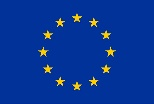

# Welcome to the GEAM manual {.unnumbered}

```{r echo=FALSE, fig.align='center', out.width="70%"}
#bookdown::render_book("index.Rmd", "bookdown::gitbook")
#bookdown::render_book("index.Rmd", "bookdown::pdf_document2")
knitr::include_graphics(path="images/ACT_GEAM_Logo_2.png")
```

This document provides hands-on guidance for setting up and launching a Gender Equality Audit and Monitoring (GEAM) questionnaire.

The GEAM has been developed in the frame of the ACT project. See <https://www.act-on-gender.eu> for details.

To use the GEAM survey instrument please visit <https://geam.act-on-gender.eu> and apply for an account.

The most recent version of this manual is found at <https://act-on-gender.eu/geam-manual> comments and contributions are welcome on [Github](https://github.com/actongender/geam-manual).

<p>

 

</p>

------------------------------------------------------------------------

<p>

 

</p>

```{r echo=FALSE, fig.align='center', out.width="22%"}
knitr::include_graphics(path="images/ACT_logo_300dpi_high.jpg")
```

<p>

 

</p>

```{r echo=FALSE, out.width="14%", fig.align="center", out.extra=ifelse(knitr::is_html_output(), "style='float:left; padding-right:12px;'", "")}
knitr::include_graphics(path="images/EUflag.jpg")
```

This project has received funding from the European Union's Horizon 2020 research and innovation programme under grant agreement No 788204.

+------------------------------------------+---------------------------------------------------------------------------------------------------------------------------------------------+
| {width="86"} | This project has received funding from the European Union's Horizon 2020 research and innovation programme under grant agreement No 788204. |
+------------------------------------------+---------------------------------------------------------------------------------------------------------------------------------------------+

# Preface {.unnumbered}

This document provides hands-on guidance for setting up and launching a Gender Equality Audit and Monitoring (GEAM) questionnaire. The GEAM is an integrated environment for carrying out survey-based gender equality audits in organizations. It aims to enable interested researchers as well as gender equality practitioners with little experience in the social sciences and survey methodology to deploy questionnaires that generate high-quality data.

The GEAM tool is based upon the Athena Survey of Science, Engineering and Technology (ASSET). It has been extended with new questions/topics and adapted to better fit the varying national contexts in Europe. The GEAM tool has been developed within the framework of the ACT project. Development was lead by Advance HE (UK), FUOC (Spain) and Notus (Spain) in collaboration with the Consortium.

The following document provides concrete instructions to setup and customize the GEAM questionnaire. It is structured as a hands-on manual which will take interested researchers from the initial setup of the questionnaire, to its customization, deployment and the downloading of results.

The overall support for the GEAM includes a template to generate the descriptive statistics from the survey as Word file. Guidance on in-depth analysis of questionnaire items is available as a separate manual.

The GEAM has been implemented with the LimeSurvey Community Edition survey platform. LimeSurvey is a software package for carrying out professional surveys and as such resembles similar environments such as SurveyMonkey or Google Forms. However, contrary to these commercial solutions, ACT has opted for a freely available open source survey platform, in order to comply with data protection requirements of our project, minimize long-term costs while being able to offer advanced survey features at no additional costs.

Since the ACT GEAM tool is implemented with LimeSurvey CE hosted on the ACT server, the guidance document combines issues related to the content of the questionnaire with more technical issues of using the LimeSurvey platform.

Main references to be consulted with this document:

-   The LimeSurvey Manual available online in different languages: <https://manual.limesurvey.org/> Consult this document for technical issues with the LimeSurvey platform itself.

-   The documentation of the GEAM questionnaire modules and choice of measurement scales and related scientific literature <https://zenodo.org/record/3476726>

-   The GEAM Analysis Manual including instructions on how to conduct in-depth statistical analysis and for interpreting the results is available here.

You can consult an online version of the GEAM questionnaire under the following URLs:

-   version 1: <https://www.act-on-gender.eu/survey/index.php/520000?lang=en>

-   version 2: <https://www.act-on-gender.eu/survey/index.php/511548?lang=en>

Version 1 of the GEAM has been revised during Spring 2021 incorporating feedback from several deployments in universities across Europe during 2020. The resulting version 2 of the GEAM is optimized and shortened.

## GEAM Translations {.unnumbered}

The GEAM questionnaire is available in 8 additional languages, apart from English. The translations have been made possible by the generous contributions of the following people:

+------------+----+----+--------------------------------------------------------------------------------------------------------+
| Language   | v1 | v2 | Translated and revised by                                                                              |
+:===========+:==:+:==:+========================================================================================================+
| Portuguese | x  | x  | Ana Petronilho, Universidade Nova de Lisboa, Portugal                                                  |
+------------+----+----+--------------------------------------------------------------------------------------------------------+
| German     |    |    | Kathrin Rabsch, TU Berlin, Germany                                                                     |
+------------+----+----+--------------------------------------------------------------------------------------------------------+
| Polish     | x  | x  | Ewa Krzaklewska, Paulina Sekuła, Marta Warat, Uniwersytet Jagielloński, Poland                         |
+------------+----+----+--------------------------------------------------------------------------------------------------------+
| Lithuanian | x  | x  | Aurelija Novelskaite, Vilnius University, Lithuania                                                    |
+------------+----+----+--------------------------------------------------------------------------------------------------------+
| Ukrainian  | x  | x  | Tetiana Median, Chernivtsi National Univesity, Ukraine                                                 |
+------------+----+----+--------------------------------------------------------------------------------------------------------+
| Slovenian  | x  | x  | Ana Hofman, Jovana Mihajlović, Research Centre of the Slovenian Academy of Sciences and Arts, Slovenia |
+------------+----+----+--------------------------------------------------------------------------------------------------------+
| Spanish    | x  | x  | Blas Fernandez, FLACSO Argentina                                                                       |
+------------+----+----+--------------------------------------------------------------------------------------------------------+
| French     | x  | x  | Florian Beauvallet, Conference des charge.es de mission parité diversité, cped-egalite.fr              |
+------------+----+----+--------------------------------------------------------------------------------------------------------+

## ACT Consortium {.unnumbered}

The ACT consortium consists of 17 partners: Fundació per a la Universitat Oberta de Catalunya (project coordinator, Spain), Portia (UK), NOTUS (Spain), Joanneum Research Forschungsgesellschaft MBH (Austria), Advance HE (UK), Loughborough University (UK), Facultad Latinoamericana de Ciencias Sociales (Costa Rica), Technische Universität Berlin (Germany), Karolinska Institutet (Sweden), Science Foundation Ireland (Ireland), Umweltbundesamt (Germany), Stiftung Deutsches Elektronen-Synchroton (Germany), Centre National de la Recherche Scientifique (France), Fundació Centre de Regulació Genòmica (Spain), Uniwersytet Jagiellonski (Poland), Znanstvenoraziskovalni Center Slovenske Akademije Znanosti in Umetnosti - ZRC SAZU (Slovenia), and Haskoli Islands (Iceland).

## Terms of use {.unnumbered}

+--------------------------------------------+----------------------------------------------------------------------------------------------------------------------------------------------------------------------------------------------------------------------------------------------------------------+
| {width="126"} | This work by Jörg Müller, Sergi Yanes, Memory Malibha-Pinchbeck, Kevin Guyan and the ACT Consortium is licensed under [Attribution Non Commercial ShareAlike 4.0 International (CC BY-NC-SA 4.0) license](https://creativecommons.org/licenses/by-nc-sa/4.0/). |
+--------------------------------------------+----------------------------------------------------------------------------------------------------------------------------------------------------------------------------------------------------------------------------------------------------------------+
